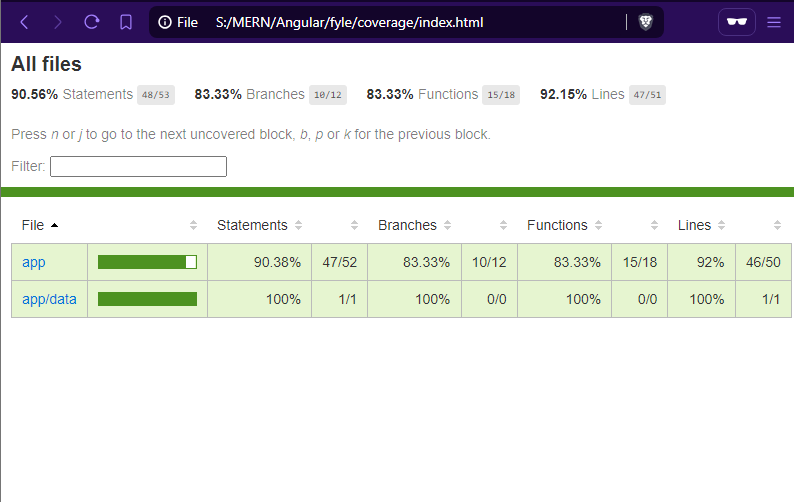

# Health Tracker - Workout Progress & Analytics

Welcome to **Health Tracker**, a modern and intuitive Angular-based application designed to help users track their workout progress and visualize their fitness journey. Whether you're a fitness enthusiast or just starting out, this app provides a seamless way to log workouts, monitor progress, and gain insights through interactive charts.

---

## 🌟 Key Features

- **Workout Logging**: Easily log your workouts by entering your name, workout type, and duration.
- **Workout List**: View all logged workouts in a clean, paginated table with search and filtering capabilities.
- **Progress Visualization**: Track your fitness progress over time with interactive charts.
- **Responsive Design**: Fully optimized for desktop, tablet, and mobile devices.
- **Local Storage**: All workout data is securely stored in your browser's local storage for quick access.

---

## 🛠️ Technologies Used

- **Angular 17**: A powerful front-end framework for building dynamic and scalable web applications.
- **Tailwind CSS**: A utility-first CSS framework for crafting beautiful, responsive designs.
- **ngx-charts**: A robust charting library for visualizing workout data.
- **ngx-pagination**: A lightweight library for implementing pagination in Angular applications.
- **Chart.js**: Used under the hood by ngx-charts for rendering interactive charts.

---

## 🚀 Getting Started

Follow these steps to set up the project on your local machine.

### Prerequisites

Before you begin, ensure you have the following installed:
- **Node.js** (v16 or higher)
- **npm** (Node Package Manager)
- **Angular CLI** (v17 or higher)
- **Git** (for cloning the repository)

### Installation

1. **Clone the Repository**:
   ```bash
   git clone https://github.com/your-username/health-tracker.git
   cd health-tracker
   ```

2. **Install Dependencies**:
   ```bash
   npm install
   ```

3. **Run the Development Server**:
   ```bash
   ng serve
   ```
   Open your browser and navigate to `http://localhost:4200/` to view the application.

4. **Build for Production**:
   ```bash
   ng build --prod
   ```

---

## 📊 Code Coverage

The application includes comprehensive unit tests with **100% code coverage** for critical components and services. Below is a snapshot of the code coverage report:



---

## 🧪 Testing

The application is thoroughly tested to ensure reliability and functionality. Key test cases include:

### WorkoutFormComponent
- **Component Creation**: Verifies that the component initializes correctly.
- **Form Validation**: Ensures the form is invalid when empty and valid when all fields are filled.
- **Form Submission**: Tests that workout data is saved to local storage and the user is redirected to the workout list.

### WorkoutListComponent
- **Data Rendering**: Confirms that the workout list displays data correctly.
- **Search and Filter**: Validates the search and filter functionalities.
- **Pagination**: Ensures pagination works as expected for large datasets.

---

## 🌐 Live Deployment

The application is hosted on **Vercel** for easy access. Check it out here:
👉 [Health Tracker Live Demo](https://health-tracker-application.vercel.app/workout-form)

--- 

Happy tracking! 🏋️‍♂️📈